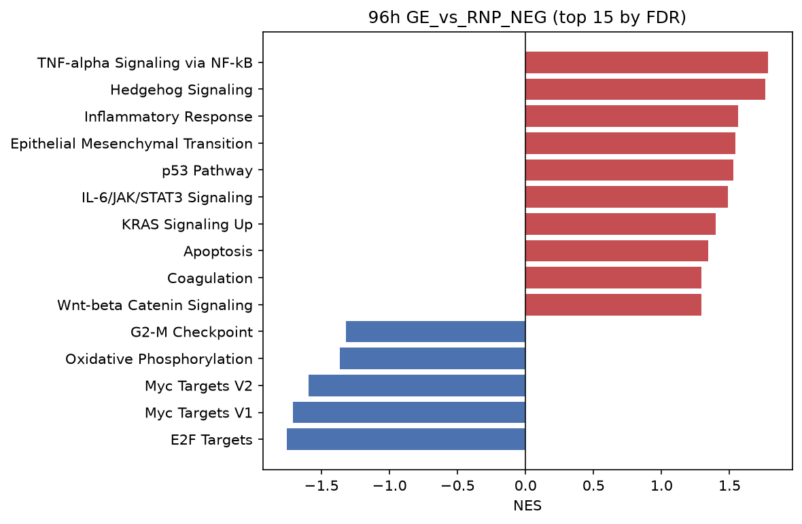
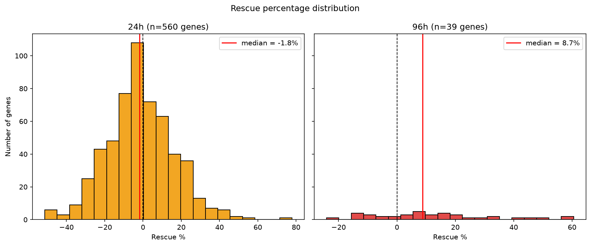

# CRISPR-Cas9/AAV6 Gene Editing in HSPCs: Reproduction and Extension

Independent computational reproduction and extension of Conti et al. (2025), which found that CRISPR-Cas9/AAV6-mediated gene editing induces a p53/DNA-damage-response and NF-κB-driven inflammatory program in human hematopoietic stem and progenitor cells (HSPCs), and that the IL-1 receptor antagonist Anakinra mitigates this response.

## Overview

Gene editing platforms based on homology-directed repair (HDR) are central to modern ex vivo cell and gene therapy. This project asks two questions:

1. **Reproduction**: Can the paper's core transcriptional findings be independently recovered using a different toolchain (Python/pydeseq2/gseapy vs. the original R/DESeq2/clusterProfiler pipeline) and independently-made QC decisions?

2. **Extension**: Can Anakinra's rescue effect be quantified on a gene-by-gene basis, beyond a simple significant/not-significant classification, and is that rescue mechanistically selective?

## Key Results

**Reproduction - part 1:** All five of the paper's specifically named Hallmark pathways were recovered with the correct direction and reached statistical significance (FDR<0.05) at both 24h and 96h post-editing:

| Pathway | NES (24h) | FDR (24h) | NES (96h) | FDR (96h) |
|---|---|---|---|---|
| p53 Pathway | +2.56 | <0.001 | +1.53 | 0.049 |
| TNF-alpha Signaling via NF-kB | +2.39 | <0.001 | +1.78 | 0.006 |
| Myc Targets V1 | -2.13 | <0.001 | -1.71 | 0.021 |
| Myc Targets V2 | -1.67 | 0.010 | -1.59 | 0.040 |
| E2F Targets | -2.34 | <0.001 | -1.76 | 0.024 |



**Reproduction - part 2:** The Anakinra rescue effect was directionally consistent with the paper (negative NES for all five target pathways at 96h), but it didn't reach individual statistical significance at this sample size (n=3/group).

- **NOTE:** The original paper's own analysis code filters to significant terms (FDR<0.05) for its primary editing-effect figure, but applies no significance filter at all to this specific Anakinra comparison. All 35 named Hallmark terms are just plotted by raw NES, significant or not. One discrepancy worth noting is that Interferon Gamma Response came out positive at 24h, which did not match the paper's claim that it's downregulated at both timepoints.

**Extension:** a continuous rescue-percentage metric was built to quantify how far Anakinra treatment moves gene expression back toward baseline. This revealed a real, timepoint-dependent signal invisible to significance-based classification alone, which is the only approach the paper used.

| Timepoint | n genes | Median rescue % |
|---|---|---|
| 24h | 560 | -1.8% |
| 96h | 39 | +8.7% |



A follow-up test of whether this rescue is mechanistically selective (favoring inflammatory/NF-κB genes over DNA-damage-response/p53 genes) was inconclusive, due to limited statistical power after controlling for numerical instability in the metric (p=0.31, n=10 and n=13).

Full results and discussion: [`notebooks/06_results_writeup.ipynb`](notebooks/06_results_writeup.ipynb)


## Data Source

- **GEO accessions**: 
    - [GSE244247](https://www.ncbi.nlm.nih.gov/geo/query/acc.cgi?acc=GSE244247) (24h) 
    - [GSE244248](https://www.ncbi.nlm.nih.gov/geo/query/acc.cgi?acc=GSE244248) (96h), 
        - **SubSeries of SuperSeries GSE244257**

- **Citation**: Conti, Anastasia, Giannetti, Kety, Midena, Federico, Beretta, Stefano, Gualandi, Nicolò, De Marco, Rosaria, Carsana, Edoardo, Varesi, Angelica, Tavella, Teresa, Alessandrini, Laura, Zarghamian, Parinaz, Weber, Alessandra, Ferrari, Samuele, Brombin, Chiara, Gilioli, Diego, della Volpe, Lucrezia, Xie, Stephanie Z., Merelli, Ivan, Cathomen, Toni, … Di Micco, Raffaella. (2025). Senescence and inflammation are unintended adverse consequences of CRISPR-Cas9/AAV6-mediated gene editing in hematopoietic stem cells. Cell Reports. Medicine, 6(6), Article 102157. https://doi.org/10.1016/j.xcrm.2025.102157

- **Design**: 
    - Cell Line: primary cord blood-derived HSPCs 
    - Conditions: RNP_NEG, GE, GE_ANAK 
    - Timepoints: 2 (24h / 96h) 
    - Biological Replicates: 3 bio reps
    - Number of bulk RNA-seq samples: 18

    **Note: the two timepoints were sequenced using different library preparation protocols (24h: paired-end stranded; 96h: single-end unstranded), per the original paper's methods.**


## Repository Structure

```
├── config/ # project configuration (paths, design, thresholds)
├── data/
│ ├── raw/ # GEO featureCounts matrices (not tracked)
│ └── processed/ # filtered counts, metadata (not tracked)
├── src/hspc_response/ # installable package: io, qc, DE, enrichment, rescue, plotting
├── notebooks/
│ ├── 01_data_loading_and_qc.ipynb
│ ├── 02_reproduction_differential_expression.ipynb
│ ├── 03_reproduction_enrichment.ipynb
│ ├── 04_extension_rescue_classification.ipynb
│ ├── 05_extension_mechanism_split.ipynb
│ └── 06_results_writeup.ipynb
├── results/
│ ├── figures/
│ └── tables/
└── tests/ # pytest test suite
```

## Setup

```bash
git clone https://github.com/kimberly42787/hspc-rnaseq-gene-editing-response.git
cd hspc-rnaseq-gene-editing-response
conda env create -f environment.yml
conda activate hspc-rescue
pip install -e .
```

Download the two raw counts matrices from GEO into `data/raw/`

For an exact reproduction of the environment used in this project (pinned package versions), use `environment-lock.yml` instead of `environment.yml`.

## Reproducing the Analysis

Run the notebooks in order, 01 through 06. Each notebook loads its inputs from `data/processed/` or `results/tables/`, so they can be run independently once the prior notebook's outputs exist.

## Testing

```bash
pytest tests/ -v
```

## Limitations

- Small sample size (n=3 per condition per timepoint) limits statistical power, particularly for the Anakinra rescue effect.

- 24h and 96h samples were sequenced with different library preparation protocols (per the original paper), so cross-timepoint comparisons should be interpreted with this in mind. Separate models were fit per timepoint to avoid conflating this technical difference with a biological time effect.

- Five literature-curated senescence gene sets used in the original paper's Figure 1I were not reproduced here; only Hallmark pathway results were used, which independently confirm the paper's core finding.

- This is a single independent computational reanalysis, not independent biological replication.

- **Full details: [Limitations, notebook 06](notebooks/06_results_writeup.ipynb).**